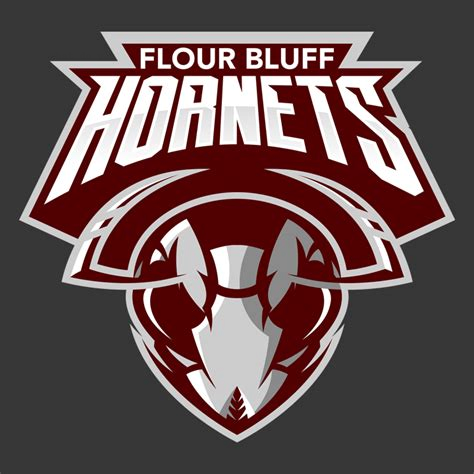

# Image Puzzles and Steganography

## Part 1 - Parlante Image Puzzles - parlante.py
Each of the following is a Parlante image puzzle—an image that has been obscured with **digital noise**. You must recover the original image by attenuating this noise as outlined below.

The image files provided are all `png` files. As such, they not only have R, G, and B values, they also have a 4th value in the tuple: A (for "alpha" aka transparency).  To unpack the values in a loaded pixel map, you can just use:
``` python
r,g,b,a = pix_map[x,y]
```
You do *not* have to include the alpha value when re-assigning a color to a PNG image.

### Iron Image Puzzle


The `iron-puzzle.png` image is a puzzle; it contains an image of something famous, however the image has been distorted. The famous object is in the red values, however the red values have all been divided by 10, so they are too small by a factor of 10. The blue and green values are all just meaningless random values ("noise") added to obscure the real image. You must undo these distortions to reveal the real image. First, set all the blue and green values to 0 to get them out of the way. Look at the result .. if you look very carefully, you may see the real image, although it is very very dark (way down towards 0). Then multiply each red value by 10, scaling it back up to approximately its proper value. What is the famous object?

### The Copper Image Puzzle


The `copper-puzzle.png` also shows something famous, and has been distored. The true image is in the blue and green values, however all the blue and green values have all be divided by 20, so the values are very small. The red values are all just random numbers, noise added on top to obscure things. Undo these distortions to reveal the true image.

First, set the red values to 0 to get that of the way. You may be able to see the image very faintly at this point, but it is very dark. Then multiply the blue and green values by 20 to get them back approximately to their proper values. What is the famous object?


### The West Image Puzzle


The `west-puzzle.png` also shows something famous and has been distorted. Use conditionals along with other pixel techniques to recover the true image. The true image is exclusively in the blue values, so set all red and green values to 0. The hidden image is encoded using only the blue values that are less than 16 (that is, 0 through 15). If a blue value is less than 16, multiply it by 16 to scale it up to its proper value. Alternately if a blue value in the encoded image is 16 or more, it is random garbage and should be ignored (interpreted as 0). This should yield the recovered image, but all in the blue channel. As a final fix, the image should be in the red channel to look more correct, so change your code to also move the values from the blue channel to the red channel.


### Your Turn
Modify the `my_puzzle` function to "noisify" an image of your choice changing two of the color channels to random numbers and doing some other transformations on the 3rd color.  Save the resulting image as my-puzzle.jpg.  Upload your noisified image and a brief explanation of how to get back to de-noisify it to [the Google Sites page](https://sites.google.com/flourbluffschools.org/2019-2020-advcs/parlante-puzzles).

<sub>These activities are borrowed from <a href="http://nifty.stanford.edu/2011/parlante-image-puzzle/">nifty image puzzles</a>.</sub>

## Part 2 - Steganography
Steganography is the practice of concealing a file, message, image, or video within another file, message, image, or video. We can hide secret messages in plain sight by modifying the RGB values of an image.  

Here is a seemingly harmless picture:



But it has a secret.  If you examine the RGB values of the pixels, most of them have something in common.  What is it?

Run the file `steganography.py` as is and look at the output.  Hint: It's more than just them being 55.  Scroll up a bit and see what other values you can find.  What do they all seem to have in common?

The ones who don't share this commonality hold the secret.  Modify the `decode()` function in `steganography.py` so that any pixels that are different, ie. don't share this same condition as the others, change to black. Make all of the other pixels (those that have the thing in common) to white.  You can get rid of the `print`.

You should now see part of the message.  The other part can be found by applying the same condition as before to ONLY the red part of each pixel.

### How Is This Achieved?

First off, we have to use PNG files for this.  JPG files use what is called "lossy" compression.  This means that some of the data may be changed/lost when you save a JPG file.  PNGs on the other hand use "lossless" compression, which means no data is lost when the image is stored.  This is why PNG files tend to have larger file sizes than JPGs.

Create a new function called `encode()` in the `steganography.py` module.  Here is the basic algorithm for hiding text in an image:

1. Open/Load the "host" image (the one that will be hiding the message)
2. Create a blank (white) image that is the same size as the host
3. Put the text on this blank image (we'll call it the "message" image) in black
    * To put text on an image use the following:
        ``` python
        draw = ImageDraw.Draw(msg_img)
        draw.text(xy,"secret message",text_color)
        ```
        Where xy is a tuple holding the top left (x,y) coordinate of the text, and `text_color` is a tuple with the RGB value of the color of the text (in this case probably (0,0,0))
    * You will probably want to use `msg_img.show()` after trying this out to see what the text actually looks like.

4. Loop through every pixel of the "host" image and change them in a very small way so they all share a common trait (all even/odd, all reds are even/odd, etc.)
5. Loop through every pixel in the "message" image.  If the pixel is black, undo the change to the corresponding pixel from step 4.

That's pretty much it.  Save the resulting image. Of course, you should test it out with your `decode()` function to make sure it's working correctly.

Encode a message and upload your image (with decode instructions) to [the Google Sites page](https://sites.google.com/flourbluffschools.org/2019-2020-advcs/secret-messages).
